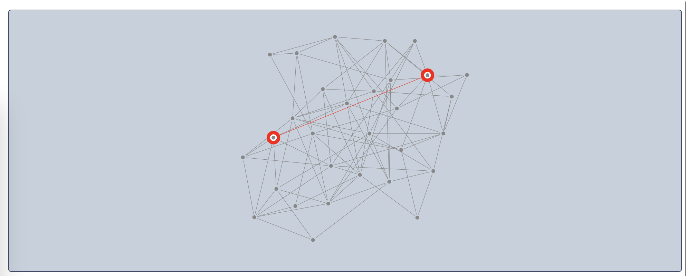

# Ogma component for NiceGUI



[NiceGUI](https://nicegui.io) is a Python web framework for building user interfaces. It is built on top of Vue.js and provides a simple and intuitive API for creating web applications.

Adding custom components if fairly simple. This repo shows how to add the Ogma component to NiceGUI.

The Ogma JavaScript file is not included in this repo. You can download it from the [Linkurious Customer Center](https://get.linkurio.us/en/login).

## Installation

```bash
poetry install
poetry run python main.py
```

